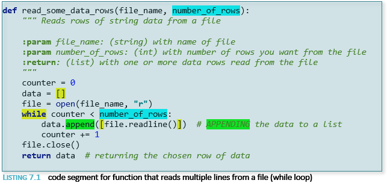

*M.Bruce* 
*Aug 21, 2022* 
*IT FDN 110 (B)* 
*Assignment 07* 
*Link:(GitHub repository)- https://github.com/Jane2024/IntroToProg-Python-Mod07* 
*Link:(GitHub Webpage)-  https://jane2024.github.io/IntroToProg-Python-Mod07/* 
 
<h1 align="center">Pickling and Error handling in Python</h1> 

## Introduction
This week covered reading and writing to text files, reading and writing to binary files using Pickle and error handling with try/except blocks. In addition, learning how to use markdown language to format a GitHub web page. The assignment for the week had us research Pickling in Python and error handling, then create demos to shown these principles in action. This knowledge document will cover the above topics and also be reflected on the newly created GitHub web page.

### Text Files

#### Read and Write Modes
In Python, we have learned to open a file for read or write:
file = open(file_name, "r"), file = open(file_name, "w"), then
used data= file.read() and file.write(strData +”\n”)  file objects to read and write data from and to text files. 
Then closed the file: file.close().

This would read in all data from a text file or write a string to a text file. There are other options that extend this functionality to perform more specific read/write tasks.

#### Append Mode
When opening a file for write in “w” access mode, if there is existing data in a current file, it will be deleted. If opening a file for write, numerous write calls can be done and it will append data as long as the file remains open. Once the file is closed, a new open for write call in “w” access mode will delete the contents and overwrite with new content. Additional access modes allow new data to be appended to existing files. One would be with the append access mode: open(file_name, "a").

#### Other reading options
Other read-based access modes include:
open(file_name, "r+")   Read and write from text file. If the file does not exist Python will throw an error.
open(file_name, "a+")  Append and Read from text file. If the file exists, it is appended to, if it does not exist it will be created
open(file_name, "w+")  Write to and read from a  text file. If the file exists, it will be overwritten, if it does not exist it will be created.    

When a call is made to read a file using the  open(file_name, "r") followed by data = file.read() object method, the entire contents of the file is returned as string and assigned to the variable. But sometimes the desired action is only to read a specific amount of data like a character or line of data. This can be done by modifying the read object method and placing a number between the parentheses.

For example: data = file.read(5) will read the first 5 characters in the file. The next read call (while the file remains open) will start up at the sixth character. This can continue till the end of the file, at which point empty strings will be returned. To read from the beginning of the file, then closing and reopening for read will restart at the beginning of the file.

The readline() method allows reading the current line of data from the file or specifying a number of characters from the current line to be read. Each new call to readline() (as long as the file is open) will advance and read the next line of data. Advancing one line at a time is called cursor. Closing and reopening the file starts reads at the first line again. A “while” loop can be used to advance through a file reading multiple lines. _**Listing 7.1**_ below shows a function that handles reading multiple rows using the readline() method.

!

