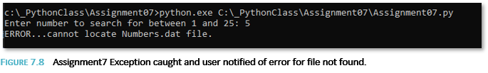

*M.Bruce* 
*Aug 21, 2022* 
*IT FDN 110 (B)* 
*Assignment 07* 
*Link:(GitHub repository)- https://github.com/Jane2024/IntroToProg-Python-Mod07* 
*Link:(GitHub Webpage)-  https://jane2024.github.io/IntroToProg-Python-Mod07/* 
 
<h1 align="center">Pickling and Error handling in Python</h1> 

## Introduction
This week covered reading and writing to text files, reading and writing to binary files using Pickle and error handling with try/except blocks. In addition, learning how to use markdown language to format a GitHub web page. The assignment for the week had us research Pickling in Python and error handling, then create demos to shown these principles in action. This knowledge document will cover the above topics and also be reflected on the newly created GitHub web page.

### Text Files

#### Read and Write Modes
In Python, we have learned to open a file for read or write:
file = open(file_name, "r"), file = open(file_name, "w"), then
used data= file.read() and file.write(strData +”\n”)  file objects to read and write data from and to text files. 
Then closed the file: file.close().

This would read in all data from a text file or write a string to a text file. There are other options that extend this functionality to perform more specific read/write tasks.

#### Append Mode
When opening a file for write in “w” access mode, if there is existing data in a current file, it will be deleted. If opening a file for write, numerous write calls can be done and it will append data as long as the file remains open. Once the file is closed, a new open for write call in “w” access mode will delete the contents and overwrite with new content. Additional access modes allow new data to be appended to existing files. One would be with the append access mode: open(file_name, "a").

#### Other reading options
Other read-based access modes include:
open(file_name, "r+")   Read and write from text file. If the file does not exist Python will throw an error.
open(file_name, "a+")  Append and Read from text file. If the file exists, it is appended to, if it does not exist it will be created
open(file_name, "w+")  Write to and read from a  text file. If the file exists, it will be overwritten, if it does not exist it will be created.    

When a call is made to read a file using the  open(file_name, "r") followed by data = file.read() object method, the entire contents of the file is returned as string and assigned to the variable. But sometimes the desired action is only to read a specific amount of data like a character or line of data. This can be done by modifying the read object method and placing a number between the parentheses.

For example: data = file.read(5) will read the first 5 characters in the file. The next read call (while the file remains open) will start up at the sixth character. This can continue till the end of the file, at which point empty strings will be returned. To read from the beginning of the file, then closing and reopening for read will restart at the beginning of the file.

The **readline()** method allows reading the current line of data from the file or specifying a number of characters from the current line to be read. Each new call to readline() (as long as the file is open) will advance and read the next line of data. Advancing one line at a time is called cursor. Closing and reopening the file starts reads at the first line again. A “while” loop can be used to advance through a file reading multiple lines. _**Listing 7.1**_ below shows a function that handles reading multiple rows using the readline() method.

The readlines() method, reads all the lines in a file, and returns a list. This is different than the read() function, which reads all the lines in a file and returns a string. An example of reading a file with existing rows and the readlines() method is listed below in _**Listing 7.2**_.

Another option to read multiple rows of data would be to use a "for" loop. A for loop automatically closes the file when it reaches the end of the file's data. 

Lastly, the **"with"** construct, which helps make the code cleaner and easier to read and also automatically closes the file when the code reaches the end of the "with" block. This ensures that a resource is "cleaned up" when the code using it finishes running, regardless if exceptions are thrown. Example code block is in _**Listing 7.3**_ below.

**Syntactic sugar** is a syntax that allow humans to write code easier, it makes the code sweeter. The “with” construct is an example

### Binary files
In Python, when data is serialized (converted to a byte stream) and stored in a binary file, it is called “pickling”. When it is deserialized (converted back to a Python object), it is called un-pickling.  Any type of python object can be pickled.

#### Lab 7-1 Working with binary files
For Lab 7-1, create a function that saves data to a binary file. Then open the file and read
its contents. See _**Figure 7.1**_ for Lab7-1 code that defines functions that save and read binary data.

See _**Figure 7-2**_ below for Lab7-1 output when run in cmd shell. The program prompts for user to input an ID and a Name. It stores the ID and name in variables and adds those to a list of users. A function is called to open a file and store the list of users in binary form(pickle it). Then a function is called that reads the binary data from the file (un-pickles it) and returns it in list form. That call is made within a print function, so the read function is immediately evaluated and printed out.

### Error Handling
Try-except blocks in Python allow errors to be caught and handled in a customized way. Built-in error handling can be cryptic to understand and customizing a response in the try-except block can provide more useful information when an error occurs. In addition, Python has an “exception” class that can create exception objects to hold data about the error when one occurs. In this class are built-in classes to handle specific errors. The try statement always runs and contains the portion of the code that is being check for error. If an error occurs, the except clause handles it. If no error occurs, the except clause does not run, the program bypasses it. The exception object  is captured in the “except” section of the try-except block. See _**Listing 7.4**_ below.

**What each statement prints out:**
print(e)- basic name of error   “division by zero” 
print(type(e))- the exception class that handled the error “<class “ZeroDivisionError”> 
print(e.__doc__)- the doc string error message “The Second argument to a division or modulo operation was zero”. 
print(e.__str__())- the error string “division by zero” 

#### GitHub Pages
A GitHub page uses “markdown” language to format information in the page. It is converted into HTML via an application called Jekyll. A “index.md” file contains the markdown commands and data for the GitHub page.
This files is located in the main branch in the docs folder in each GitHub repository.

### Assignment 07
This assignment is to create a demo script that provides an example of the use of Pickling in Python and Error Handling.

#### Create Script
1) Opened PyCharm and created folder named “Assignment07”
2) Created a new project **Assignment07.py**at:
     C:/_PythonClass/Assignment07/**Assignment07.py**

#### Example script demoing pickling, un-pickling and error handling 
I decided to do a combination script which would use pickling to store a list of numbers in a binary format, then use un-pickling to load the list from file and error handling to check that the file existed and if not inform the user.

#### Pickling
A function “create_file()” was designed to create a list of numbers from 1 to 25, store them in a list and then store that list in a binary file named “Numbers.dat” using “pickle.dump”. _**Figure 7.3**_ shows the code for that function below.

#### Un-Pickling
Another function was designed to unpickle the file into a list and allow the user to search that list for a number. Variables were created to hold the file name “strFilename”, a Boolean flag to be set if the number was found “bolFoundIt”, a list for the numbers “list_of_numbers”.
Then  “pickle.load(file)” was used to de-serialize the data in the binary file “Numbers.dat” and store in the list variable- “list_of_numbers”. 

A For Loop was used to cycle through the list to check for the user provided number. If found, it notifies the user it found the number in the list, sets the flag “bolFoundIt” to true and exits. Else it will continue the loop till it finds the number or reaches the end of the list. Once the end of the list is reached, it exists the for loop and a check is done of the flag to determine if the number was found. If not, it notifies the user and exits program. See code for this function in _**Figure 7.4**_ below.

The body of the program simply calls the two functions to create and file and store it, then load it and search it.
_**Figure 7.5**_ shows this below.

When the program is run, and the user enters a number, if it is found, the user is notified – _**Figure 7.6**_

If the user entered number is not found, then the user is notified as well _**Figure 7.7**_

#### Error Handling

A try/except block is placed around the code segment which loads the file into the list. If the Numbers.dat is not found in the current working directory as the python script, then the except clause will execute and inform the user the file could not be located and exit the program. A test was done without running the “create_file()” function to test if the except clause would catch the error. It did. See _**Figure 7.8**_.

### Summary
In the module07, the main take away for me was the use of pickling to serialize data and store in a binary file using pickle.dump() and then how to de-serialize it, by unpickling the file using pickle.load(). Not sure how much I will use it, since research showed it is not secure and is dependent on both ends of the process utilizing the same version of python. But it is a handy thing to learn as a newbie to Python and an alternate to storing to a text file. 
The TRY/BLOCK error handling is something that will be used in every program I create going forward since it is critical to allow for a program to catch errors and fail gracefully. There is an extensive the list of built-in exception errors to help handle this, or I can build custom ones. The last task was to take the knowledge document and format it for display on my newly created GitHub web page using markdown language

